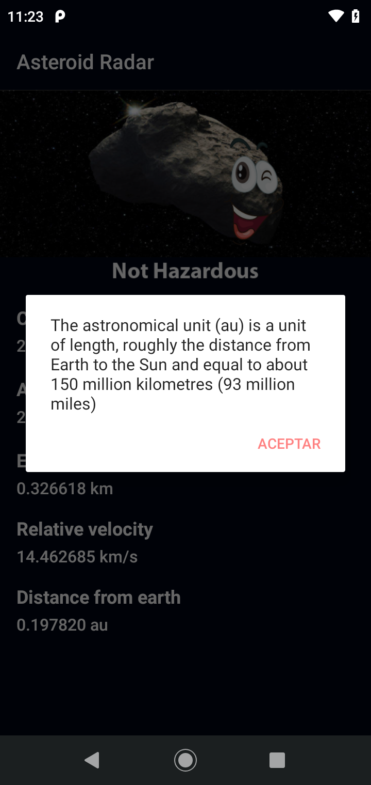

# Asteroid Radar

## About

Asteroid Radar is an app to view the asteroids detected by NASA that pass near Earth, you can view all the detected asteroids in a period of time, their data (Size, velocity, distance to Earth) and if they are potentially hazardous.

## Features

You will be provided with a starter code, which includes the necessary dependencies and plugins that you have been using along the courses and that you are going to need to complete this project. 

The application you will build will:
- Include Main screen with a list of clickable asteroids as seen in the provided design.
- Include a Details screen that displays the selected asteroid data once it’s clicked in the Main screen as seen in the provided design. The images in the details screen are going to be provided here, an image for a potentially hazardous asteroids and another one for the non potentially hazardous ones.
- Download and parse data from the NASA NeoWS (Near Earth Object Web Service) API.
- Save the selected asteroid data in the database using a button in details screen.
- Once you save an asteroid in the database, you should be able to display the list of asteroids from web or the database in the main screen top menu.
- Be able to cache the asteroids data by using a worker, so it downloads and saves week asteroids in background when device is charging and wifi is enabled.
- App works in multiple screen sizes and orientations, also it provides talk back and push button navigation.

## Technical Details

- MVVM (repository pattern) + ViewModel + Data Binding+ LiveData 
- Room Database
- RecyclerView
- Retrofit
- Kotlin Coroutines
- WorkManager
- Single activity 
- Localized for multiple languages
- Navigation component

## Built With

Uses the NASA NeoWS (Near Earth Object Web Service) API, which you can find here.
https://api.nasa.gov/

### Screenshots

